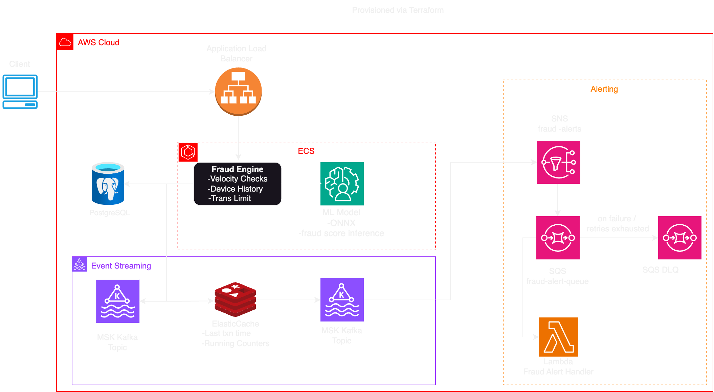

# Event-Driven Fraud Detection System

An event-driven fraud detection backend built with **Spring Boot**, **Apache Kafka**, **PostgreSQL**, and **AWS**.  
Transactions are processed asynchronously, evaluated by a rule-based engine (with optional ML scoring), and fraud alerts are delivered using **SNS → SQS → Lambda**.  
All AWS infrastructure is provisioned using **Terraform**.

---

## Architecture



---

## System Flow

1. Client submits transaction via REST API  
2. Transaction is persisted and published to Kafka  
3. Fraud Engine consumes events and evaluates fraud rules  
4. Fraud result is published to the `fraud-results` topic  
5. Alert Service publishes fraud alerts to SNS  
6. SNS fans out messages to SQS  
7. Lambda processes alerts with retries and DLQ support  

---

## Tech Stack

- Java 21, Spring Boot  
- Apache Kafka  
- PostgreSQL  
- Redis  
- AWS SNS, SQS, Lambda  
- Terraform (Infrastructure as Code)  
- Docker & Docker Compose  

---

## Fraud Detection

- Amount threshold rule (> $5000)  
- Velocity-based checks (Redis-backed)  
- Decline pattern rules  
- Extensible, pluggable rule engine  
- Optional ML scoring using ONNX Runtime  

---

## Local Development

### Prerequisites

- Java 21+
- Maven
- Docker & Docker Compose

---

### Start Dependencies (Kafka + Redis)

```bash
docker compose up -d
```

---

### Build the Application

```bash
mvn clean package
```

This generates the executable JAR:

```text
target/fraud-0.0.1-SNAPSHOT.jar
```

---

### Run the Application

```bash
java -jar target/fraud-0.0.1-SNAPSHOT.jar
```

The service starts on:

```text
http://localhost:8080
```

---

### Sample API Request

```http
POST /api/transactions
Content-Type: application/json
```

```json
{
  "transactionId": "txn123",
  "accountId": "acct1",
  "merchantId": "m123",
  "amount": 7500.00,
  "currency": "USD"
}
```

---

## Infrastructure (AWS)

Provisioned via Terraform:

- SNS topic for fraud alerts  
- SQS queue + Dead Letter Queue  
- Lambda alert processor  
- IAM roles and policies  
- ECS Fargate-ready architecture  
- MSK-ready Kafka integration  

## Deploying to AWS (ECS Fargate)

This project supports full cloud deployment using **AWS ECS (Fargate)** with **MSK**, **RDS**, **ALB**, **SNS**, **SQS**, and **Lambda**, all provisioned via Terraform.

### Prerequisites

- AWS account
- AWS CLI configured (`aws configure`)
- Terraform >= 1.5
- Docker

---

### Required Environment Variables

The ECS task definition injects the following environment variables:

```text
SPRING_PROFILES_ACTIVE=prod

SPRING_DATASOURCE_URL=jdbc:postgresql://<rds-endpoint>:5432/frauddb
SPRING_DATASOURCE_USERNAME=frauduser
SPRING_DATASOURCE_PASSWORD=<db-password>

KAFKA_BOOTSTRAP_SERVERS=<msk-bootstrap-brokers>

FRAUD_ALERTS_TOPIC_ARN=<sns-topic-arn>
```

These are populated automatically by Terraform during ECS task definition creation.

---

### Build & Push Docker Image

```bash
# Build image
docker build -t fraud-engine .

# Authenticate to ECR
aws ecr get-login-password --region us-east-2 | \
  docker login --username AWS --password-stdin <ACCOUNT_ID>.dkr.ecr.us-east-2.amazonaws.com

# Tag & push
docker tag fraud-engine:latest <ECR_URI>:latest
docker push <ECR_URI>:latest
```

---

### Deploy Infrastructure

```bash
cd fraud_infra
terraform init
terraform apply
```

This provisions:
- VPC, subnets, and security groups
- Application Load Balancer
- ECS Cluster and Fargate Service
- MSK (Kafka)
- RDS (PostgreSQL)
- SNS, SQS, Lambda, IAM

---

### Access the Service

After deployment completes:

```text
http://<alb-dns-name>/api/transactions
```

Health check endpoint used by ALB:

```text
GET /actuator/health
```

---

### Notes

- ECS tasks run on **AWS Fargate**
- Kafka connectivity is internal via VPC
- ALB performs health checks before routing traffic
- Kafka Admin warnings do not block application startup

---

## Docker (Optional)

```bash
docker build -t fraud-engine .
docker run -p 8080:8080 fraud-engine
```

---

## Future Enhancements

- Deploy services to AWS ECS Fargate  
- Replace local Kafka with AWS MSK  
- Expand velocity and behavioral fraud rules  
- Add ML feature enrichment  
- Add observability with CloudWatch and Grafana  
- Terraform modules for ECS and networking  

---

## Notes

- Architecture diagram: `fraud.png`  
- Designed for both local development and cloud deployment  
- Follows event-driven and cloud-native design principles  
